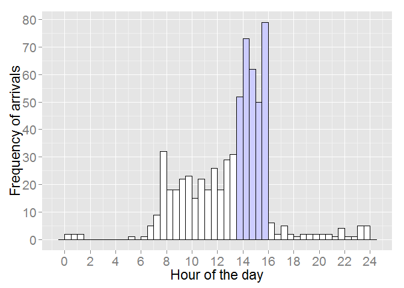
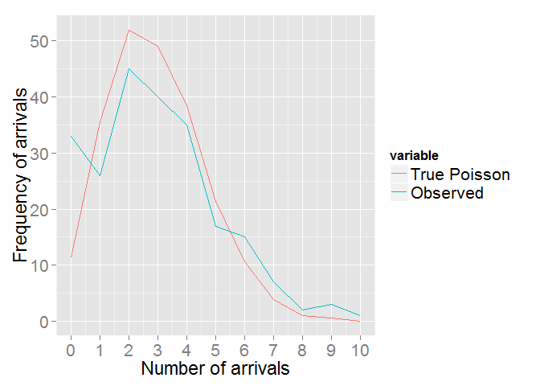
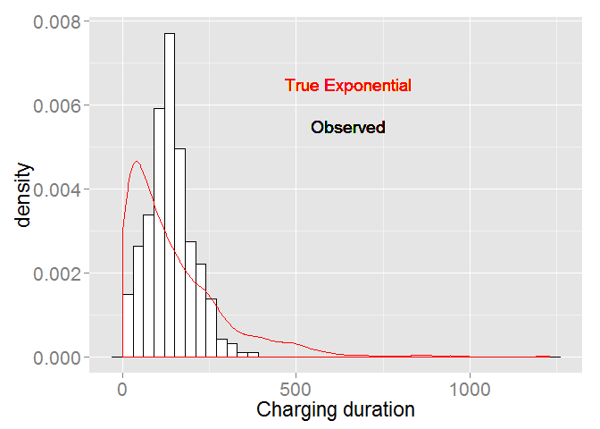
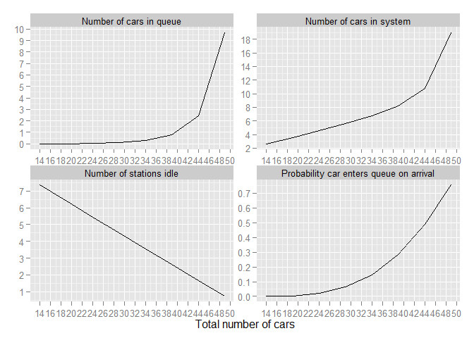
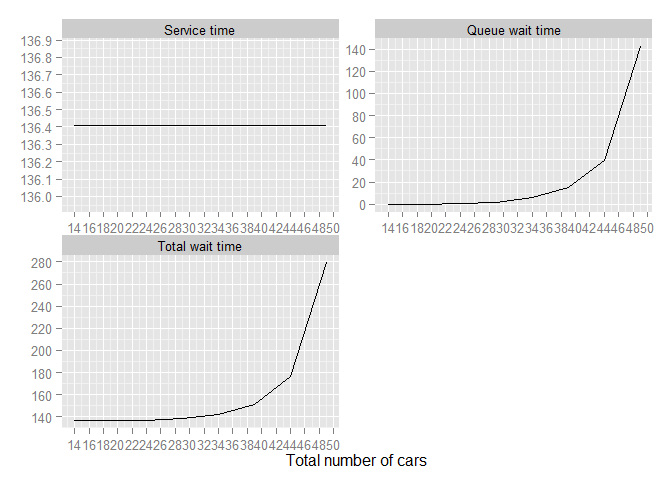

# Queuing report with R code guide
Ken Lau  
Saturday, April 04, 2015  
### Summary and Introduction
This report analyzes charging congestion of electric vehicles (EV). An intuitive explanation of congestion is to imagine cars arriving at a station to be charged. Let us say only one car can be charged at a time at the station. Say car 1 arrives first and begins charging, and before car 1 finishes charging, cars 2 and 3 arrive. Both cars 2 and 3 are now put in a queue until car 1 finishes charging so that there is an available spot for charging. Analyzing congestion is especially important when we consider expanding the current infrascture by increasing the number of cars in operation. It is intuitive that increasing the number of cars increases the arrival rate and ultimately increases the congestion. 

The analysis involves a M/M/c queuing model that analyzes the congestion of charging cars based on the arrival rates and charging durations of cars.
The M/M/c queuing model makes two assumptions: 

- Number of car arrivals per hour is Poisson distributed.
- Charge duration is exponentially distributed.

After computing the arrival rate and charge duration, the queuing model uses these parameters as inputs, and computes useful information about the congestion such as the following:

- The number of cars in the queue on average.
- The number of cars in the system on average, which also refers to the number of cars that are either in the queue or currently charging.
- The number of stations that are idle on average.
- The probability that a car enters the queue on average upon arrival.
- The average time of waiting in the queue.
- The average total waiting time, which includes both the queue wait time if required and the time to charge.
- The service time also refers to the charging time on average.


```r
library(plyr) # for data manipulation
library(ggplot2) # for plotting
library(dplyr) # for data manipulation
library(lubridate) # for data time conversions
library(reshape2) # for data manipulation
library(scales) # for plotting
```


```r
# functions to validate the assumptions of the queuing model used
source("src//queuing-model-validator.R")
# functions to fit the queuing model and compute the statistics
source("src//queuing-modeller.R")
```

Each tuple of the data provides information from when the car plugs into a specific port and station to begin charging to when the car leaves the station. 

The columns of the data set that are relevant to our analysis are listed below with brief descriptions:

- Station_Name : The name of the station.
- Port: The port number either 0 or 1. Each station has 2 ports.
- start_date : The date the car arrives.
- charging_duration : The duration of charge.
- Start_Time_hr : The hour the car arrives in a 24 hour day.
- Card.Nick.Name : The id of the car.


```r
# Read in the data.
dat = read.csv("data//cleanDat1.txt")
# Concatenate the station name with the port number and define 
# it as a new column in the data called Port_Name. 
# In this data set, each station contains two ports so we are 
# interested in the number of charging ports rather than stations.
dat$Port_Name = paste0(dat$Station_Name, "_Port", dat$Port)
```

Compute the number of arrivals based on an interval of time of the day which is presumed to be the busiest in terms of car arrivals as we see in the plot defined by gg1 below.


```r
# Define an interval of hours of a day we think is busiest.
# lower threshold 13.5 corresponds to 1:30 pm
# upper threshold 16 corresponds to 4:00 pm
lower = 13.5; upper = 16;
# keep only the tuples of the data that have arrival times in hours between
# lower and upper
datSubset = filter(dat, (Start_Time_hr>=lower & Start_Time_hr<=upper))
```

Plot out the frequency of arrival times in terms of hour of a day.
The interval forming the busiest times of data (lower, upper) is 
highlighted in light blue.


```r
xBreaks = seq(0, 24, by=2)
yBreaks = seq(0, 80, by=10)
gg1 = ggplot(dat, aes(x=Start_Time_hr)) + 
				geom_histogram(colour="black", fill="white", binwidth=.5) + 
				ylab("Frequency of arrivals") + 
				xlab("Hour of the day") + 
				theme(axis.title=element_text(size=17), 
					axis.text=element_text(size=16)) + 	
				scale_x_continuous(breaks=xBreaks) + 
				scale_y_continuous(breaks=yBreaks) + 
				geom_histogram(data=datSubset, fill="blue", colour="black", 
											 binwidth=.5, alpha=.2)
gg1
```

 

A M/M/c queuing model is used to analyze the queuing involved in the EV charging stations. In particular, we are intersted in increasing the number of cars in operation, and how that might affect cars having to queue at charging stations.

To use the M/M/c model, we need to estimate the arrival rates per hour and charging duration of cars. Before we can compute the arrival rate per hour, we need to compute the frequency of number of arrivals within the range lower and upper defined above. 

As the M/M/c model assumes that cars randomly arrive and leave as soon as the car is finished charging, the analysis is less concrete than the exploratory analysis, but nonetheless provides some useful information about how the queue is impacted as the number of cars in operation increases.

The M/M/c model assumes that the number of cars arriving at the charging stations per hour is Poisson distributed, and the charding duration is Exponentially distributed. We first validate that the number of arrivals within the ranges lower and upper is Poisson distributed. 


```r
# Compute the frequency of the number of arrivals within times lower and 
# upper.
computeArrivalFrequencies = function(dat, lower, upper) {
	# Number of times cars do not arrive within times lower and upper.
	# See queuing-model-validator.R for computeCount0 function.
	count0 = computeCount0(dat, lower, upper)
	# Compute frequencies of number of arrivals that have >= 1 arrivals
	allCounts = group_by(dat, start_date) %>% dplyr::summarise(counts=n())
	allCounts = table(allCounts$counts)
	# Combine the frequencies of no arrivals with >= 1 arrivals to get 
	# a vector of frequencies
	allCounts = c("0"=count0, allCounts)
	return(allCounts)
}

# Frequency of the number of arrivals within times lower and upper.
allCounts = computeArrivalFrequencies(dat, lower, upper)

# Estimate of the arrival rate within lower and upper ranges based on allCounts.
# See queuing-model-validator.R
yhat = computeArrivalRate(allCounts)
```

One way to validate the assumption that the number of arrivals is Poisson distributed is to compare the observed number of arrivals with the true number of arrivals from a Poisson distribution. This comparison is shown below by the plots from plotValidateArrivals funtion.


```r
# Compute true frequencies of number of arrivals
expectPois = table(rpois(10000, yhat))
expectPois = expectPois/(10000/sum(allCounts))
```


```r
#Plot out two curves corresponding to the observed frequency of number of arrivals and true frequency of arrivals from a Poisson distribution. If the two curvers appear to overlap each other then the assumption that the number of arrivals is Poisson appears to be valid.

plotValidateArrivals = function(allCounts, expectPois) {
	ggdat = data.frame(index=names(allCounts), allCounts)
	ggdat$index = as.numeric(as.character(ggdat$index))
	ggdat2 = data.frame(index=names(expectPois), 
											expectPois=as.numeric(expectPois))
	ggdat2$index = as.numeric(as.character(ggdat2$index))
	ggdat2 = left_join(ggdat2, ggdat, by="index")
	ggdat2 = ggdat2[complete.cases(ggdat2),]
	ggdat2 = melt(ggdat2, measure.vars=c("expectPois", "allCounts"))
	hash = c("expectPois"="True Poisson", "allCounts"="Observed")
	ggdat2$variable = revalue(ggdat2$variable, hash)
	gg2 = ggplot(ggdat2, aes(x=index,y=value,color=variable)) + 
		geom_line() + xlab("Number of arrivals") + 
		ylab("Frequency of arrivals") + 
		scale_x_continuous(breaks=pretty_breaks(n=8)) + 
		theme(axis.title=element_text(size=17), 
					axis.text=element_text(size=16), 
					legend.text=element_text(size=16),
					legend.title=element_text(size=13)) 	
	return(gg2)	
}

gg2 = plotValidateArrivals(allCounts, expectPois)
gg2
```

 

The two curves seem to agree for most of the arrivals from 1 to 10 except when the number of arrivals equal to 0. 

Now we validate the assumption that charging duration is exponentially distributed.


```r
# Concerning ourselves with only the tuples within the start time hours of lower and upper, we compute the average charging duration of cars in hours.
avgChargeDuration = mean(datSubset$charging_duration)
# Next compute the charging rate in #cars/hr
serviceRate = 1/mean(datSubset$charging_duration)
# Compute the expected charging durations from a true Exponential distribution.
expectExpDf = data.frame("exp"=rexp(1000, rate=serviceRate)) 

# Plot to compare the observed and true charging durations.
gg3 = ggplot(datSubset, aes(x=charging_duration)) + 
				geom_histogram(aes(y=..density..), colour="black", fill="white", 
											 binwidth=30) + 
				geom_density(data=expectExpDf, aes(x=exp, y=..density..),
										 colour="red") + 
				xlab("Charging duration") + 
				theme(axis.title=element_text(size=17), 
					axis.text=element_text(size=16)) + 
				geom_text(aes(650, .0065, label="True Exponential"), color="red") + 
				geom_text(aes(650, .0055, label="Observed"))
gg3
```

 

The above plot reveals that the observed charging durations appear to be more normally distributed than exponentially distributed. The mean charging duration appear to be 120 minutes. As the M/M/c model assumes the charging duration to be exponentially distribution, the above plot violates that assumption. However, for educational purposes, we continue with our analysis and make careful claims about our results while noting the fact that charging duration appears normally distributed instead of exponential. 


```r
# Assign the mu variable as the service rate. Multiply it by 60 to convert it from hours to minutes.
mu = serviceRate
mu = mu*60
# Compute the number of avaliable charging ports.
s = length(unique(datSubset$Port_Name))
# Compute the number of cars in operation.
numOrigCars = length(unique(datSubset$Card.Nick.Name))
# A vector to denote the number of additional cars to put in operation.
additionalCars = seq(0,35,by=5)
```

Note that we have previously computed the arrival rate within the times lower and upper. Say lower=13.5 and upper=16, then the arrival rate is in units of number of arrivals per 2.5 hours (16-13.5). Instead, we are interested in the arrival rate per hour. The arrival rate per hour is computed by dividing the arrival rate per 2.5 hours (using the same example) by 2.5 (eg. upper- lower). The following R code updates the arrival rate parameter and stores the new arrival rate in a new variable called lambda.


```r
# Arrival rate per hour
# See queuing-modeller.R for the function computeArrivalRatePerHour
lambda = computeArrivalRatePerHour(yhat, lower, upper)
```

We next compute new arrival rates in response to including more cars in operation. Recall that we have assumed that the number of arrivals is Poisson distributed.
 
Let us define a random variable Y as the number of arrivals which is Poisson distributed with rate lambda per hour. The number of cars as we know, is numOrigCars (14). Let us define another random variable X representing the number of arrivals, also Poisson distributed, with arrival rate lambda independent of Y (strong assumption). The total number of arrivals of Y and X is then Poisson distributed, since Y is indpendent of X with arrival rate 2*lambda. Therefore (based on our assumptions), if we double the number of cars in operation, then the arrival rate also doubles. The new arrival rates are computed in the following function.


```r
buildInputsDf = function(allCounts, numOrigCars, additionalCarsArr, mu, s, 
												lambda, lower, upper) {
	out = c()
	for(addCars in additionalCarsArr) {
		newLambda = lambda + addCars*(1/numOrigCars)*lambda
		out = rbind(out, c(newLambda, mu, s, numOrigCars+addCars))
	}
	out = data.frame(out)
	names(out) = c("lambda", "mu", "s", "n")
	return(out)
}
```


```r
# New arrival rates based on number of cars in operation.
# inputsDf is a dataframe with information on the arrival rate, service rate, number of charging ports, and number of cars in total.
inputsDf = buildInputsDf(allCounts, numOrigCars, additionalCars, mu, 
						s, lambda, lower, upper)

# Take the inputsDf as input and computes the statistics of the M/M/c model. See queuing-modeller.R.
computeStatsDf = function(inputsDf) {
	out = c()
	for(i in 1:nrow(inputsDf)) {
		lambda = inputsDf[i,"lambda"]; 
		mu = inputsDf[i,"mu"]
		s = inputsDf[i,"s"]
		n = inputsDf[i,"n"]
		stats = computeStats(lambda, mu, s, n)		
		statsNames = names(stats)
		stats = unname(unlist(stats))
		out = rbind(out, stats)	
	}
	row.names(out) = NULL
	out = data.frame(out)
	names(out) = statsNames
	out = cbind(inputsDf, out)
	return(data.frame(out))
}
```


```r
# The statistics of the M/M/c model that would help us answer questions about the congestion and how to expand the infrastructure
statsDf = computeStatsDf(inputsDf)

# Add a new column corresponding to the average charging duration.
statsDf = mutate(statsDf, serviceTime=1/mu)
# Convert any quantities in units of hours to minutes
statsDf = convertStatsDfHrToMin(statsDf)

plots = plotStats(statsDf)

plots$gg1
```

 

```r
plots$gg2
```

 

There are several patterns present in the above plots. We notice that the number of cars in the queue, waiting time in the queue, and total wait time increases very quickly when the total number of cars in operation is greater than 34. In particular, the wait time in the queue is approximately 0 minutes when the total number of cars is less than 30, but reaches 80 minutes when the total number of cars is 46. Using this information, we suggest to increase the number of stations if the total number of cars in operation is more than 34. 

We also notice that the number of cars in the system (which are either charging or in the queue) and the probability a car enters the queue upon arrival increases earlier than in the case of number of cars in the queue. At a total number of 36 cars, the chance of entering the queue upon arrival is 20%. The chance of entering the queue quickly rises to 70% when there is a total of 49 cars in operation.

We also point out that the first figure appears to indicate that the number of idle stations decreases linearly. Furthermore, the second plot shows that the charging duration (indicated by service time) is the same no matter how many cars we put into operation which is intuitive since increasing the number of cars is independent of how quickly cars are charged. 


